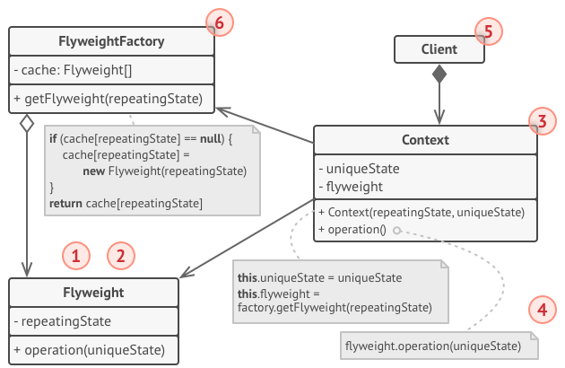

# 1 享元模式（Flyweight pattern）
**享元模式定义**：（结构型模式）运用共享技术有效地支持大量细粒度的对象。

# 2 目标问题
&emsp;&emsp;在有大量对象时，有可能会造成内存溢出，我们把其中共同的部分抽象出来，如果有相同的业务请求，直接返回在内存中已有的对象，避免重新创建

# 3 解决方法
&emsp;&emsp;用唯一标识码判断，如果在内存中已经存在，则返回这个唯一标识码所标识的对象

# 4 所有类之间的关系

1. Flyweight 接口：通过这个接口享元可以接受并作用于外部状态
2. ConcreteFlyweight:
   - 实现 FlyWeight 接口，并为内部状态增加存储空间。ConcreteFlyweight 对象必须是可以共享的。存储的是内部状态。
3. UnsharedConcreteFlyweight 类： 
   - 不被共享的 ConcreteFlyweight 类。即 Flyweight 并不强制共享。在 flyweight 对象结构的某些层次，UnsharedConcreteFlyweight 对象通常将 ConcreteFlyweight 对象作为子节点
4. Client 类：维持一个对享元的引用，计算或存储享元的外部状态
5. FlyweightFactory：享元工厂类，创建并管理 Flyweight 对象

# 5 代码实现
```go
// 享元工厂类
type FlyweightFactory struct {
	maps map[string]*Flyweight
}

var flyweightFactory *FlyweightFactory

// 单例模式实现的 FlyweightFactory
func GetFlyweightFactory() *FlyweightFactory {
	if flyweightFactory == nil {
		flyweightFactory = &FlyweightFactory{
			maps: make(map[string]*Flyweight),
		}
	}
	return flyweightFactory
}
// 获取一个享元的指针
func (f *FlyweightFactory) Get(filename string) *Flyweight {
	image := f.maps[filename]
	if image == nil {
		image = NewFlyweight(filename)
		f.maps[filename] = image
	}
	return image
}
// 一个享元对象
type Flyweight struct {
	data string
}
// 新的享元
func NewFlyweight(filename string) *Flyweight {
	// Load image file
	data := fmt.Sprintf("image data %s", filename)
	return &Flyweight{
		data: data,
	}
}

func (i *Flyweight) Data() string {
	return i.data
}
// 一个视图
type Viewer struct {
	*Flyweight
}

func NewViewer(filename string) *Viewer {
	image := GetFlyweightFactory().Get(filename)
	return &Viewer{
		Flyweight: image,
	}
}

func (i *Viewer) Display() {
	fmt.Printf("Display: %s\n", i.Data())
}
// 用户逻辑
func main() {
	viewer1 := NewViewer("image1.png")
	viewer2 := NewViewer("image1.png")
	if viewer1.Flyweight == viewer2.Flyweight {
		fmt.Println("使用同一个享元")
	}
	// output：使用同一个享元
}
```
# 6 应用场景
- 一个系统有大量相同或者相似的对象，由于这类对象的大量使用，造成内存的大量耗费。
- 对象的大部分状态都可以外部化，可以将这些外部状态传入对象中。

⭐使用享元模式需要维护一个存储享元对象的享元池，而这需要耗费资源，因此，应当在多次重复使用享元对象时才值得使用享元模式

# 7 优缺点

## 7.1 优点
- 享元模式的优点在于它可以极大减少内存中对象的数量，使得相同对象或相似对象在内存中只保存一份
- 享元模式的外部状态相对独立，而且不会影响其内部状态，从而使得享元对象可以在不同的环境中被共享

## 7.2 缺点
- 享元模式使得系统更加复杂，需要分离出内部状态和外部状态，这使得程序的逻辑复杂化
- 为了使对象可以共享，享元模式需要将享元对象的状态外部化，当每次调用享元方法时，都要重新计算某些上下文，会导致运行速度变慢

# 8 相关模式
- 享元模式通常和组合模式结合起来，用共享叶节点的有向无环图实现一个逻辑上的层次结构
- 最好用享元模式实现 State 和 Strategy 对象

# 9 reference
1. 《设计模式》-享元模式
2. [design-patterns:Flyweight pattern](https://refactoring.guru/design-patterns/flyweight)