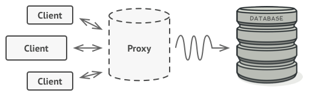
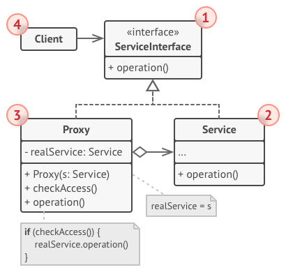

# 1 代理模式（Proxy pattern）
**代理模式定义**：（结构型模式）为其他对象提供一种代理以控制对这个对象的访问，让你可以在请求到达原始对象之前或之后执行某些操作。

# 2 目标问题
&emsp;&emsp;为什么要控制对象的访问呢？假设存在一个小号大量系统资源的庞大对象，偶尔需要使用，但并不是经常使用。那么可以延迟初始化，在真正需要时再进行创建。对象的所有客户都需要执行一些延迟的初始化代码，这会导致许多代码的重复。
&emsp;&emsp;可能在想为什么不能将这些初始化代码放进类库供用户逻辑进行调用呢，这是库并不是所有时候都是客修改的，例如封闭的第三方库等。

# 3 解决方法
&emsp;&emsp;创建一个代理类用来接收逻辑层的所有操作，并通过这个代理层来和底层的库进行交互。被代理的服务对象的初始化以及交互操作均经过代理类。

# 4 所有类之间的关系

1. ServiceInterface 接口：声明被代理对象的接口，代理通过实现该接口伪装成被代理对象以对用户透明
2. Service：定义 Proxy 所代表的实体
3. Proxy：代理层，用来和被代理对象交互
   - 保存一个引用使得代理可以访问实体
   - 提供一个与 ServiceInterface 接口相同的接口，用来代替 Service
   - 控制对 Service 的操作，并可能负责创建或者删除它
4. Client：客户通过和拥有 ServiceInterface 接口的 Proxy 层进行交互而不用关心 Service

# 5 代码实现
&emsp;&emsp;这里仅仅展示了一个十分简单的代理模式框架，在真实项目中会经常用到代理模式，某些情况下是十分复杂的。
```go
// 代理和被代理对象均实现的接口，用来给用户进行使用
type ServiceInterface interface {
	Do()
}
// 被代理对象
type Service struct{}

func (Service) Do() {
	fmt.Println("被代理对象中执行操作")
}
// 代理对象，和用户以及被代理对象进行交互
type Proxy struct {
	ser Service
}
// 通过在代理类中使用被代理对象的接口
func (p Proxy) Do() {
	fmt.Println("调用代理之前可以执行一些操作")
	// 调用真实对象
	p.ser.Do()
	fmt.Println("调用代理之后可以执行一些操作")
}
// 用户逻辑
func main() {
	var service ServiceInterface
	service = &Proxy{}
	service.Do()
}

```
运行结果如下：

# 6 应用场景
- 远程(Remote)代理：为一个位于不同的地址空间的对象提供一个本地的代理对象
- 虚拟(Virtual)代理：如果需要创建一个资源消耗较大的对象，先创建一个消耗相对较小的对象来表示，真实对象只在需要时才会被真正创建
- Copy-on-Write代理：它是虚拟代理的一种，把复制（克隆）操作延迟到只有在客户端真正需要时才执行
- 保护(Protect or Access)代理：控制对一个对象的访问，可以给不同的用户提供不同级别的使用权限
- 缓冲(Cache)代理：为某一个目标操作的结果提供临时的存储空间，以便多个客户端可以共享这些结果
- 防火墙(Firewall)代理：保护目标不让恶意用户接近
- 同步化(Synchronization)代理：使几个用户能够同时使用一个对象而没有冲突
- 智能引用(Smart Reference)代理：当一个对象被引用时，提供一些额外的操作，如将此对象被调用的次数记录下来等

# 7 优缺点

## 7.1 优点
- 代理模式能够协调调用者和被调用者，在一定程度上降低了系统的耦合度
- 远程代理使得客户端可以访问在远程机器上的对象，远程机器可能具有更好的计算性能与处理速度，可以快速响应并处理客户端请求
- 虚拟代理通过使用一个小对象来代表一个大对象，可以减少系统资源的消耗，对系统进行优化并提高运行速度
- 保护代理可以控制对真实对象的使用权限

## 7.2 缺点
- 因为新增加了一个代理类，所以用户服务的响应可能会延迟
- 实现代理模式需要额外的工作，有些代理模式的实现非常复杂

# 8 相关模式
- 适配器模式为包装的对象提供了不同的接口，代理模式为它提供了相同的接口，装饰模式为它提供了增强的接口
- 装饰模式与代理模式类似，两者都缓存一个复杂的实体并自行对其进行初始化。与装饰模式不同，代理模式具有与其服务对象相同的接口，这使它们可以互换
- 装饰模式和代理模式具有相似的结构，但意图却大不相同。两种模式均基于构图原理，即一个对象应将某些工作委托给另一对象。区别在于，代理通常自行管理其服务对象的生命周期，而装饰器的组成始终由客户端控制

# 9 reference
1. 《设计模式》-代理模式
2. [design-patterns:Proxy pattern](https://refactoring.guru/design-patterns/proxy)