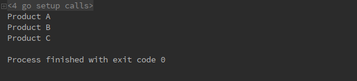

# 1 原型模式（Prototype pattern）
**原型模式定义**：用原型实例指定创建对象的种类，并且通过拷贝这些原型创建新的对象。

# 2 目标问题
&emsp;&emsp;如果有一个对象，你想要创建它的一份拷贝。那么你要生成一个新的对象，然后，将所有目标对象中的字段复制到新的对象。
但是这样做会带来一些问题：
- 你怎么直到目标对象的确切类型呢，有时候你仅仅是通过一个接口或者父类来获取这个对象的，你并不知道它地真实 class
- 有些对象中不可见的字段怎么进行复制呢？例如类中 private 的字段等

# 3 解决方法

&emsp;&emsp;为了解决上面的问题，我们提供一个克隆接口，通常仅仅包含一个方法：clone(),用户可以仅仅使用该接口来对对象进行克隆，而不需考虑对象的结构。
&emsp;&emsp;支持克隆的对象成为原型。在使用时你可以创建一组各种方式配置的对象，当你需要其中一个对象时，进行克隆即可。

# 4 所有类之间的关系

1. Prototype 接口：定义了对象的 clone 接口
   - 也可以和工长方法一样，定义相同操作接口
   - 它将 Client 和 ConcretePrototype 隔离开来了
2. ConcretePrototype 类：定义了要实现的具体对象
3. 可以获得任何实现了 Prototype 接口的对象的克隆
4. PrototypeManager 类：用来统一管理特定的几种对象
   - 通过 PrototypeManager 会所的获取特定表示对象的克隆

# 5 代码实现
实现结构很简单，结构如下所示：
```go
package main

import "fmt"
// 产品的克隆接口
type Prototype interface {
	clone() Prototype
	getName() string
}
// 具体的产品类
type Product struct {
	name string
}
// 克隆自身
func (p *Product) clone() Prototype {
	return &Product{name: p.name}
}
func (p *Product) getName() string {
	return p.name
}

// Prototype Manager，原型管理器
type PrototypeManager struct {
	m map[string]Prototype
}
// 获取新的克隆对象
func (p *PrototypeManager) getProduct(s string) Prototype {
	return p.m[s].clone()
}

func (p *PrototypeManager) setProduct(s string, proto Prototype) {
	p.m[s] = proto
}

// 客户逻辑
func main() {
	a := Product{name: "Product A"}
	b := Product{name: "Product B"}
	c := Product{name: "Product C"}
	manager := PrototypeManager{m: make(map[string]Prototype)}
	manager.setProduct("A", &a)
	manager.setProduct("B", &b)
	manager.setProduct("C", &c)
	cloneA := manager.getProduct("A")
	cloneB := manager.getProduct("B")
	cloneC := manager.getProduct("C")
	fmt.Println(cloneA.getName())
	fmt.Println(cloneB.getName())
	fmt.Println(cloneC.getName())
}
```
运行结果如下：


# 6 应用场景

- 当逻辑代码不依赖于需要复制的具体对象类时，应该使用Prototype模式
- 当要实例化一个对象在运行时指定时
- 当想要减少仅在初始化各自对象的方式上有所不同的子类时，使用该模式
  - 可能已经创建了这些子类，以便能够直接创建具有特定配置的对象

# 7 优缺点

## 7.1 优点
- 可以克隆对象而无需耦合到它们的具体类的结构
- 可以去除重复的初始化代码，而直接去克隆预构建的原型
- 用来创建复杂的对象

## 7.2 缺点
- 当循环引用的复杂对象会十分麻烦，因为不小心就会无限创建下去，导致内存泄漏

# 8 相关模式

- 抽象工厂模式和原型模式既可以竞争。抽象工厂也可以使用原型模式，即存储一个被克隆原型的集合，并返回产品对象（把普通工厂换为克隆工厂）
- 使用 Composite pattern 和 Decorator pattern 设计通常也需要使用原型模式

# 9 reference

1. 《设计模式》-原型模式  
2. [design-patterns:Prototype pattern](https://refactoring.guru/design-patterns/prototype)