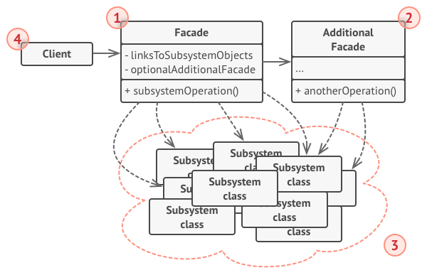
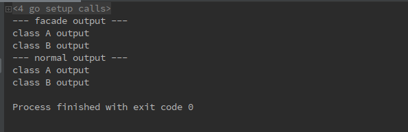

# 1 外观模式（Facade pattern）
**外观模式定义**：（结构型模式）为子系统中一组接口提供一个一致的界面，Facade 模式定义了一个高层接口，这一接口使得子系统更加容易地进行使用。

# 2 目标问题
&emsp;&emsp;加入你要在一个巨大的框架上进行开发。很显然，如果直接使用框架层的对象以及方法是很不明智地。一般大家都会对其进行封装来进行使用，简化它的接口。用来将业务逻辑和框架代码分离开来，会让开发和维护更加容易。

# 3 解决方法
&emsp;&emsp;创建一个类使用外观模式，用来为子系统提供简单易用的接口。一直接使用子系统相比，虽然这个类并没有新的方法，但是它会很好的简化用户对子系统的使用难度。

# 4 所有类之间的关系

1. Facade 接口：知道那些子系统负责处理请求，将客户的请求代理交给适当的子系统对象
2. Additional Facade：其他外观用来特化外观的功能，可以对多个子系统进行更好的区分管理
3. Complex Subsystem class
   - 实现子系统的功能
   - 处理由 Facade 对象指派的任务
   - 没有 Facade 的任何相关信息，既没有指向 Facade 的指针

# 5 代码实现
```go
// 创建新的 facade 层
func FacadeAPI() API {
	return &FacadeAPIImpl{
		a: NewAClass(),
		b: NewBClass(),
	}
}

// Facade 提供的 API
type API interface {
	FacadeOutput() string
}

// Facade 层
type FacadeAPIImpl struct {
	a APIclassA
	b APIclassB
}

// 实现 Facade 的接口
func (f *FacadeAPIImpl) FacadeOutput() string {
	res1 := f.a.AOutput()
	res2 := f.b.BOutput()
	return fmt.Sprintf("%s\n%s", res1, res2)
}

// 创建子系统（class A）的对象的工厂方法
func NewAClass() APIclassA {
	return &classA{}
}

// class A 的 API
type APIclassA interface {
	AOutput() string
}

// 子系统 A
type classA struct{}

func (*classA) AOutput() string {
	return "class A output"
}

// 创建子系统（class B）的对象的工厂方法
func NewBClass() APIclassB {
	return &classB{}
}

// class B 的 API
type APIclassB interface {
	BOutput() string
}

// 子系统 B
type classB struct{}

func (*classB) BOutput() string {
	return "class B output"
}
```
上面代码通过 Facade 将 class A 和 class B 进行封装使用
```go
// 客户端逻辑，分别通过 Facade 和直接使用两个子系统来进行调用
func main() {
	facadeAPI := FacadeAPI()
	facadeRes := facadeAPI.FacadeOutput()
	a := NewAClass()
	b := NewBClass()
	normalRes := a.AOutput() + "\n" + b.BOutput()
	fmt.Println("--- facade output ---")
	fmt.Println(facadeRes)
	fmt.Println("--- normal output ---")
	fmt.Println(normalRes)
}
```
&emsp;&emsp;运行结果如下，可以看出两种方式的运行结果是相同的,这也表示 Facade 仅仅提供了一层对子系统的封装：

# 6 应用场景
- 当你要为一个复杂的子系统提供一个简单的接口时。子系统往往因为不断演化而变得越来越复杂，大多数模式使用时都会产生更小的类。这使得子系统更加具有可复用性，更容易对子系统进行定制，但也为那些不需要定制的用户带来困难。Facade 提供一个简易的视图，对大多数用户已经足够，如果需要更细的使用力度越过 Facade 层即可。
- 客户程序与抽象类的实现部分之间存在很大的依赖性。引入 Facade 将这个子系统与客户以及其他的子系统进行分离，可以提高系统的独立性和可移植性。
- 当您要将子系统构建为多层时，使用外观模式减少各层之间的耦合程度。

# 7 优缺点
## 7.1 优点
- 可以将代码与子系统的复杂性隔离，屏蔽了子系统的组件。使子系统使用起来更加简单
- 它实现了用户与子系统的松耦合关系。而子系统内部的功能组件往往是紧耦合的，这使得子系统内部进行改变并不会影响用户逻辑代码
- 如果用户需要，并不会限制他们使用子系统类。因此你可以根据自己的需要判断是否需要越过 Facade 层
## 7.2 缺点
- 不能很好地限制客户使用子系统类，如果对客户访问子系统类做太多的限制则减少了可变性和灵活性
- 在不引入抽象外观类的情况下，增加新的子系统可能需要修改外观类或客户端的源代码，违背了“开闭原则”

# 8 相关模式
- 抽象工厂可以和外观模式一起使用，提供一个接口，用来创建用户所需的对象。
- 通常 Facade 是单例模式的

# 9 reference
1. 《设计模式》-外观模式
2. [design-patterns:Facade pattern](https://refactoring.guru/design-patterns/facade)