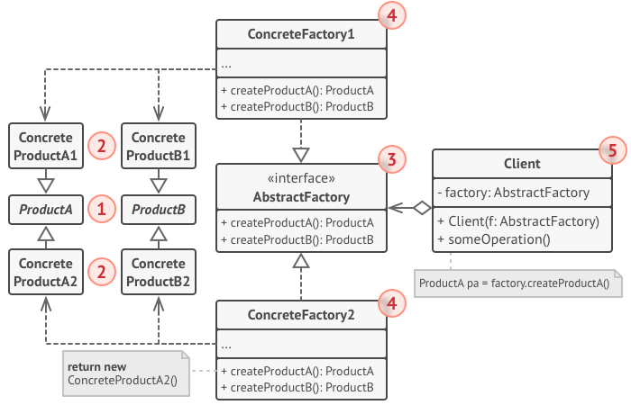
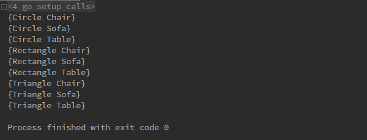

# 1 抽象工厂模式（Abstract factory pattern）

**抽象工厂模式定义**：提供接口，创建一系列相关或独立的对象，而不指定这些对象的具体类  
&emsp;&emsp;这里强调了抽象工厂用来创建的是一系列的对象，当一个项目需要提供不同的系列的相同对象并且每个系列之间没有关联时，使用抽象工厂可以对构建一个总接口作为所有系列的共同父亲，用父类来统一创建所有对象。这样就不需要根据不同的系列硬编码到自己的工程中，只需要在总接口处进行系列的转换即可。
# 2 目标问题


存在一个情景：

```
你需要生产一系列的家具：椅子，沙发，桌子  
分为不同形状的 3 个系列：圆形，矩形，三角形。  
```
&emsp;&emsp;如果单纯的进行生产，就需要 9 个工厂，分别是 圆形+椅子，圆形+沙发......三角形+桌子。并且在客户需要家具的时候还需要去不同的工厂进行取货。但这样不仅很繁琐，并且用户一不注意可能会拿到不是同一个系列的家具。当需要添加新的产品或系列的时候，就会导致你的核心代码会频繁的进行修改。  

# 3 解决方法

&emsp;&emsp;对每种家具构建一个接口，例如 Chair 接口，所有不同的椅子都实现这个统一的接口进行创建，所有的桌子都实现 Desktop 接口进行创建。  
&emsp;&emsp;之后建造一个大工厂用来生产一套家具，包含所有产品（椅子，沙发，桌子）的总接口，可以让所有的系列工厂都实现这一系列接口。比如抽象工厂有 CreateChair 接口，所有系列的大工厂均有 CreateChair 接口，沙发，桌子依次类推。  
&emsp;&emsp;现在，当客户想要购买家具时，仅需要到他需要的工厂（他喜欢系列的工厂），依次发出 CreateChair,CreateDesktop,CreateSofa 指令即可，它不需要关系这些家具是什么系列，因为他在需要购买家具选择系列的时候就进入了对应的工厂。所以客户在购买家具时仅仅需要关系的就是他需要的最基础的类型，是椅子还是桌子等。

# 4 所有类之间的关系


1. 抽象产品(AbstractProduct):为一类产品对象声明一个接口(eg:椅子)
2. 具体产品(ConcreteProduct):创建一个具体产品的对象(eg:圆形椅子)
3. 抽象工厂(AbstractFactory):一个抽象工厂的接口,用来创建抽象接口
4. 具体工厂(ConcreteFactory):用来生产一个系列的各种对象
5. 客户(Client):获取特定的 ConcreteFactory 来创建同一系列的 Product.仅仅使用 AbstractFactory 定义的接口

# 5 代码实现

&emsp;&emsp;最近一直使用 GO 语言，暂时的设计模式实现也使用 Go 来进行实现，因为 GO 语言不是完全面向对象语言，没有类似 C++ 中的类，所以使用 struct，interface 来实现设计模式的代码：

## 5.1 对象的设计
```go
// 具体的不同家具的 struct
type Chair struct {   // Chair
	class string
	name  string
}
type Sofa struct {    // Sofa
	class string
	name  string
}
type Table struct {   // Table
	class string
	name  string
}

// 圆形家具工厂
type CircleFurnitureFactory struct {
}

// 矩形家具工厂
type RectangleFurnitureFactory struct {
}

// 三角形家具工厂
type TriangleFurnitureFactory struct {
}
```
&emsp;&emsp;依次设计了不同家具的 struct，这里为了不让代码太过冗长，将 Chair，Sofa，Table 都使用了一种 struct 进行表示，这里也可以将其拆分，并创建 Chair interface 等等。  
&emsp;&emsp;还包括对应的不同系列的工厂的 struct，客户根据系统配置自行选择需要使用的对象即可

## 5.2 接口的设计
```go
// 抽象工厂类
type AbstractFurnitureFactory interface {
	MakeChair() Chair
	MakeSofa() Sofa
	MakeTable() Table
}

// 不同工厂的家具生产过程，这里仅展示一个系列的代码
func (a CircleFurnitureFactory) MakeChair() Chair {
	return Chair{
		class: "Circle",
		name:  "Chair",
	}
}

func (a CircleFurnitureFactory) MakeSofa() Sofa {
	return Sofa{
		class: "Circle",
		name:  "Sofa",
	}
}

func (a CircleFurnitureFactory) MakeTable() Table {
	return Table{
		class: "Circle",
		name:  "Table",
	}
}
```
&emsp;&emsp;实现了抽象工厂接口，提供了三个接口用来生产不同的家具，之后所有工厂类依次实现该接口的所有方法即可进行统一的调用  

## 5.3 代码执行
```go
// 选择自己需要的系列
func getFurnitureFactor(class string) AbstractFurnitureFactory {

	var res AbstractFurnitureFactory
	switch class {
	case "Circle":
		res = CircleFurnitureFactory{}
		return res
	case "Rectangle":
		res = RectangleFurnitureFactory{}
		return res
	case "Triangle":
		res = TriangleFurnitureFactory{}
		return res
	}
	return nil
}

// 主函数的逻辑
func main() {
	a := getFurnitureFactor("Circle")
	b := getFurnitureFactor("Rectangle")
	c := getFurnitureFactor("Triangle")
	fmt.Println(a.MakeChair())
	fmt.Println(a.MakeSofa())
	fmt.Println(a.MakeTable())
	fmt.Println(b.MakeChair())
	fmt.Println(b.MakeSofa())
	fmt.Println(b.MakeTable())
	fmt.Println(c.MakeChair())
	fmt.Println(c.MakeSofa())
	fmt.Println(c.MakeTable())
}
```
运行结果如下：

# 6 应用场景

以下情况可以使用**抽象工厂模式**：
- 一个系统要独立于它的产品的创建、组合和表示
- 一个系统要由多个产品系列中的一个来进行配置
- 要强调一系列相关的产品对象的设计以便进行联合使用
- 提供一个产品类库，但只想显示接口而不是实现

# 7 优缺点

## 7.1 优点
- 它分离了具体的类：具体对象的生成被接口相对于客户隔离了开来，客户不需要关心它真是的类名等等
- 易于交换产品系列：只需要在初始化时进行不同系列的选择即可，不需要更改过多的客户代码，可以让用户很方便的从一个系列转换为另一个系列
- 有利于产品的一致性：当一个系列中的产品对象被设计成一起工作时，一个应用一次只能使用同一系列的对象

## 7.2 缺点
- 会让代码变得复杂：因为增加了许多接口以及新的类
- 当需要添加新的系列时，需要对所有的已有接口进行匹配
- 并且当需要添加一个新的种类时（eg：床），需要对所有工厂进行修改，以支持这种新产品

# 8 相关模式

- 抽象工厂一般基于工厂方法，也可以用原型模式（prototype）实现
- 一个具体的工厂通常是单例模式（Singletion）的

# 9 reference

1. 《设计模式》-抽象工厂  
2. [design-patterns:Abstract Factory](https://refactoring.guru/design-patterns/abstract-factory)  
3. [中文维基：抽象工厂](https://zh.wikipedia.org/wiki/%E6%8A%BD%E8%B1%A1%E5%B7%A5%E5%8E%82)  
4. [Go实战--Design Patterns in Golang 之工厂模式(简单工厂、工厂方法、抽象工厂)](https://blog.csdn.net/wangshubo1989/article/details/79270450)  