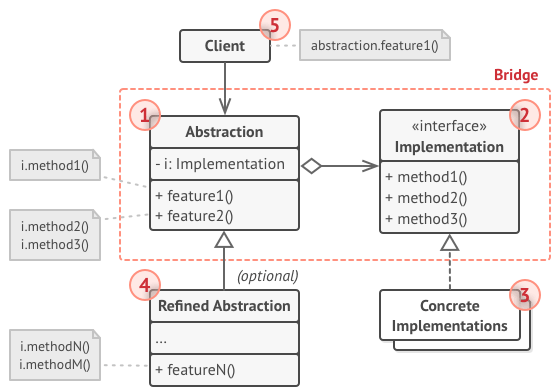
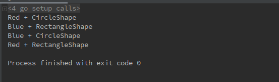

# 1 桥接模式（Bridge pattern）
**桥接模式定义**：（结构型模式）将抽象部分与它的实现部分进行分离，使它们可以独立的进行开发修改。

# 2 目标问题

&emsp;&emsp;假设我们想要绘制多种图形，包括矩形，原型，三角形等等。每种图形均可以绘制多种颜色。可以用下面两种方式进行实现：
1. 每种实例提供一个对象，总共需要 形状*颜色 多个对象
2. 根据实际需要再对颜色进行组合，将形状和颜色两个维度分离开来，最后再共同组合出所需的图形  

&emsp;&emsp;第二种方法，降低了类与类之间的耦合程度，并可以很容易的进行形状或者颜色的添加，同时也减少了代码量

# 3 解决方法

&emsp;&emsp;使用桥接模式，将图形和颜色两个维度进行分割，比如把颜色属性分离出去组成一个抽象接口，形状类所有的颜色逻辑均由颜色接口进行实现，它只需要引用这个颜色对象。

# 4 所有类之间的关系

1. Abstraction：定义抽象类地接口，维护一个指向 Implementation 类型对象的指针
2. Implementation 接口：定义实现类的接口，该接口不一定要与 Abstraction 完全一致，事实上这两个接口可以完全不同
   - 一般来说，Implementation 接口仅提供基本的操作，而 Abstraction 则定义较高层次的操作
1. Concrete Implementations：实现 Implementation 接口并定义其具体实现
2. Refined Abstractions：扩充由 Abstraction 定义的接口
3. Client：通常，客户仅仅对使用抽象感兴趣，但是，将抽象对象与实现对象之一进行连接同样是是客户的工作

# 5 代码实现
使用 Go 实现如下：
```go
// 图形接口，所有图形类均需要使用的方法
type Shape interface {
	CreateColorShape()
}
// Implementation 接口，Color 实现类的接口
type Color interface {
	AddColor(shape string)
}
// Concrete Implementation 实现
type RedColor struct{}

func NewRedColor() Color {
	return &RedColor{}
}

func (*RedColor) AddColor(shape string) {
	fmt.Println("Red + " + shape)
}
// Concrete Implementation 实现
type BlueColor struct{}

func NewBlueColor() Color {
	return &BlueColor{}
}

func (*BlueColor) AddColor(shape string) {
	fmt.Println("Blue + " + shape)
}
// Abstraction 的一种具体实现
type CircleShape struct {
	color_ Color
}

func NewCircleShape(color_ Color) *CircleShape {
	return &CircleShape{
		color_: color_,
	}
}

func (m *CircleShape) CreateColorShape() {
	m.color_.AddColor("CircleShape")
}
// Abstraction 的一种具体实现
type RectangleShape struct {
	color_ Color
}

func NewRectangleShape(color_ Color) *RectangleShape {
	return &RectangleShape{
		color_: color_,
	}
}

func (m *RectangleShape) CreateColorShape() {
	m.color_.AddColor("RectangleShape")
}
// 逻辑代码
func main() {
	s1 := NewRedColor()
	s2 := NewBlueColor()
	a := NewCircleShape(s1)
	b := NewRectangleShape(s2)
	c := NewCircleShape(s2)
	d := NewRectangleShape(s1)
	a.CreateColorShape()
	b.CreateColorShape()
	c.CreateColorShape()
	d.CreateColorShape()
}

```
运行结果如下：  

&emsp;&emsp;上面代码的整个逻辑十分简洁清晰，通过将颜色和形状两个维度进行分割，可以使代码变得清晰，即使后期需要再添加新的形状或者颜色也可以很容易的完成。
# 6 应用场景
- 如果一个系统需要在构件的抽象化角色和具体化角色之间增加更多的灵活性，避免在两个层次之间建立静态的继承联系，通过桥接模式可以使它们在抽象层建立关联关系
- 系统想要在运行时实现切换
- 一个类存在多个独立变化的维度，且这多个维度都需要独立地进行扩展
- 对于那些不希望使用继承或因为多层次继承导致系统类的个数急剧增加的系统，桥接模式尤为适用

# 7 优缺点

## 7.1 优点
- 将抽象接口及其具体实现部分进行分离
- 遵循开放/封闭原则。在不修改原系统的情况下，可以彼此独立的引入新的抽象和实现
- 单一责任原则。可以专注于抽象中的高级逻辑以及实现中的平台细节
- 实现细节对客户透明，它没有透露平台的详细信息
## 7.2 缺点
- 桥接模式的引入会增加系统的理解与设计难度，由于聚合关联关系建立在抽象层，要求开发者针对抽象进行设计与编程
- 桥接模式要求正确识别出系统中两个独立变化的维度，因此其使用范围具有一定的局限性

# 8 相关模式
- 抽象工厂模式可以用来配置一个特定的 Bridge 模式
- Adapter 模式通常在系统设计完成后使用，来帮助其他不兼容的类协同工作，而Bridge通常是预先设计的，它使得重选ing接口和实现部分可以独立运行改变

# 9 reference

1. 《设计模式》-桥接模式
2. [design-patterns:Bridge pattern](https://refactoring.guru/design-patterns/bridge)
3. [WindSun：桥接模式（例子很好）](https://www.cnblogs.com/WindSun/p/10260547.html)