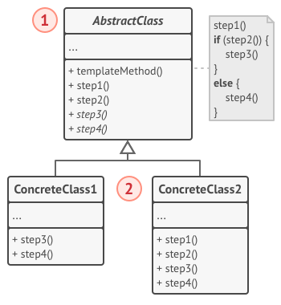
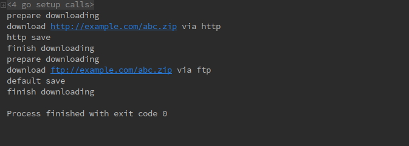

# 1 模板方法模式（Template Method pattern）
**模板方法模式定义**：（对象行为型模式）定义一个操作中的算法的骨架，而将一些步骤延迟到子类中去。模板方法模式使得子类可以不改变一个算法的结构图即可重定义该算法的某些特定步骤。

# 2 目标问题
&emsp;&emsp;你需要构建一个分析各种文档的程序，文档的种类包括：word、txt、pdf、markdown 等等。你需要从各种文档中提取出有价值的数据，并进行处理。
&emsp;&emsp;首先你先完成了对 word 文档的处理，包括文件的解析，数据的读取，数据的提取，数据的分析，分析结果的记录。接下来你有依次为这个程序添加了其余几种格式的支持。
&emsp;&emsp;等到系统完成就会发现其实不同的格式之间存在许多的相似代码。尽管在所有类中用于处理各种数据格式的代码完全不同，但是用于数据处理和分析的代码几乎完全相同。我们可以把整个算法的逻辑独立出来，可以防止代码变得过于繁杂。

# 3 解决方法
&emsp;&emsp;模板方法建议你将算法分为多个步骤，将这些步骤封装在方法中，并将这一些列的方法封装在单个模板方法对象中。在具体使用这个算法时，用户提供实现这些抽象步骤的类，并使用模板方法对象完成整个算法的逻辑即可。  
每个步骤类型可以分为两种：
- 子类必须自己实现的抽象步骤：word，pdf。。的数据读取肯定是不能通用的
- 已经具有默认的实现，但是客户也可以自己进行实现来覆盖它

# 4 所有类之间的关系

1. AbstractClass 抽象类：
   - 定义抽象的原始操作，具体的子类将重定义它们以实现一个的算法的步骤
   - 实现一个模板方法，定义一个算法的骨架。该模板方法不仅调用原语操作，也调用定义在 AbstractClass 或其他对象中的操作
2. ConcreteClass 具体类：
   - 实现原语操作以完成算法中与特定子类相关的步骤

# 5 代码实现
本节例子来源见文章末尾
```go

type Downloader interface {
	Download(uri string)
}
// 算法模板对象，包含一个 implement 接口对象（实现具体算法的子类）
type template struct {
	implement
	uri string
}
// 算法中步骤分为 download 和 save
type implement interface {
	download()
	save()
}
// 返回一个模板方法对象，具体实现子类是 impl
func newTemplate(impl implement) *template {
	return &template{
		implement: impl,
	}
}
// 整个算法执行流程，分为几个步骤
func (t *template) Download(uri string) {
	t.uri = uri
	fmt.Print("prepare downloading\n")
	t.implement.download()
	t.implement.save()
	fmt.Print("finish downloading\n")
}
// 提供一个默认的 save 方法
func (t *template) save() {
	fmt.Print("default save\n")
}
// 具体实现算法步骤子类
type HTTPDownloader struct {
	*template
}
// http 子类的工厂函数
func NewHTTPDownloader() Downloader {
	downloader := &HTTPDownloader{}
	template := newTemplate(downloader)
	downloader.template = template
	return downloader
}
// 子类实现具体的算法步骤
func (d *HTTPDownloader) download() {
	fmt.Printf("download %s via http\n", d.uri)
}
// http 子类实现了 save 方法
func (*HTTPDownloader) save() {
	fmt.Printf("http save\n")
}
// ftp 子类
type FTPDownloader struct {
	*template
}
// ftp 子类的工厂函数
func NewFTPDownloader() Downloader {
	downloader := &FTPDownloader{}
	template := newTemplate(downloader)
	downloader.template = template
	return downloader
}
// Ftp 仅仅实现了 doenload 方法
func (d *FTPDownloader) download() {
	fmt.Printf("download %s via ftp\n", d.uri)
}
// 分别使用 HTTP 和 FTP 来下载文件
func main() {
	var downloader1 Downloader = NewHTTPDownloader()
	downloader1.Download("http://example.com/abc.zip")

	var downloader2 Downloader = NewFTPDownloader()
	downloader2.Download("ftp://example.com/abc.zip")
}
```
打印结果如下：


# 6 应用场景
- 一次性实现一个算法的不变部分，并将可变的部分留给子类去进行实现
- 各个子类中公共的行为应被提取出来并集中到一个公共父类中以避免代码重复
- 控制子类扩展。模板方法只在特定点调用钩子操作，这样就只允许在这些点进行扩展

# 7 优缺点
## 7.1 优点
-  可以让客户端仅覆盖大型算法的某些特殊部分，从而使它们受到算法其他部分发生的更改的影响较小
-  可以将重复的代码放入一个父类中

## 7.2 缺点
- 某些客户端可能会受到所提供算法框架的限制
- 模板方法往往难以维护，因为它们具有的较多步骤

# 8 相关模式
- 工厂模式常用在模板方法中。
- 模板方法使用继承来改变算法的一部分，策略模式使用委托来改变整个算法

# 9 reference
《设计模式》-模板方法模式
[design-patterns:template-method pattern](https://refactoring.guru/design-patterns/template-method)
[本节代码示例](https://github.com/senghoo/golang-design-pattern/tree/master/14_template_method)