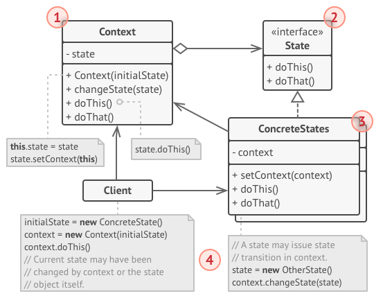
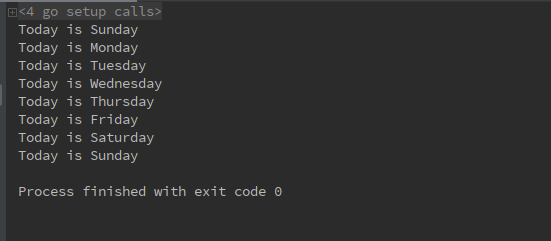

# 1 状态模式（State pattern）
**状态模式定义**：（对象行为型模式）允许一个对象在其内部状态改变时改变它的行为。对象看起来似乎修改了它的类。
&emsp;&emsp;状态模式主要解决了当控制一个对象状态表达式过于复杂时的情况。把状态的判断逻辑转移到表示不同状态的一系列类中，将复杂逻辑进行简化。

# 2 目标问题
&emsp;&emsp;在网络连接的过程中，可以使用一个 TCPConnect 对象进行管理，这个对象可能处于多种状态之间：正在监听、连接已经建立、连接关闭等等。当一个 TCPConnect 对象收到其他对象的请求时，它根据自身的当前状态做出不同的反应。使用 State 模式描述 TCPConnect 如何在每一种状态下表现出不同的行为。

# 3 解决方法
&emsp;&emsp;引入一个 TCPState 抽象类来表示网络的连接状态。TCPState 类为各个表示不同状态的操作提供了一套相同的公共接口。TCPState 的子类实现与特定状态相关的行为。例如连接关闭对应的类为 TCPClosed。
&emsp;&emsp;TCPConnect 对象通过维护一个实现了 TCPState 接口用来表示 TCP 连接状态的状态对象，并将所有和状态相关的操作交给这个状态对象进行处理即可。当 TCPConnect 的状态改变时，将这个状态对象进行替换即可。
# 4 所有类之间的关系

1. Context 类：eg：TCPConnect
   - 定义客户感兴趣的接口
   - 维护一个 ConcreteState 子类的实例，这个实例定义当前的状态
2. State 接口：
   - 所有对应的状态子类实现的接口，用来执行 Context 类在对应状态的操作
3. ConcreteState 类：可以有多个：TCPClosed、TCPListen、TCPEstablished
   - 每一个子类实现 Context 类在对应状态下的操作
4. 当 Context 状态改变时，首先创建一个新的状态对象，并将其替换掉 Context 中的对象即可

# 5 代码实现
下面展示了一个日历的例子，例子来源见本文最后：
```go
// 周一到周日所有天均实现的接口
type Day interface {
	Today()
	Next(*DayContext)
}
// 日历的 Context 类
type DayContext struct {
	today Day
}
// 创建 DayContext 的工厂函数
func NewDayContext() *DayContext {
	return &DayContext{
		today: &Sunday{},
	}
}
// DayContext 打印今天的日期
func (d *DayContext) Today() {
	d.today.Today()
}
// 下一天，状态转换
func (d *DayContext) Next() {
	d.today.Next(d)
}
// 下面依次实现了不同天数的对应操作
// Sunday
type Sunday struct{}

func (*Sunday) Today() {
	fmt.Printf("Today is Sunday\n")
}

func (*Sunday) Next(ctx *DayContext) {
	ctx.today = &Monday{}
}
// Monday
type Monday struct{}

func (*Monday) Today() {
	fmt.Printf("Today is Monday\n")
}

func (*Monday) Next(ctx *DayContext) {
	ctx.today = &Tuesday{}
}
// Tuesday
type Tuesday struct{}

func (*Tuesday) Today() {
	fmt.Printf("Today is Tuesday\n")
}

func (*Tuesday) Next(ctx *DayContext) {
	ctx.today = &Wednesday{}
}
// Wednesday
type Wednesday struct{}

func (*Wednesday) Today() {
	fmt.Printf("Today is Wednesday\n")
}

func (*Wednesday) Next(ctx *DayContext) {
	ctx.today = &Thursday{}
}
// Thursday
type Thursday struct{}

func (*Thursday) Today() {
	fmt.Printf("Today is Thursday\n")
}

func (*Thursday) Next(ctx *DayContext) {
	ctx.today = &Friday{}
}
// Friday
type Friday struct{}

func (*Friday) Today() {
	fmt.Printf("Today is Friday\n")
}

func (*Friday) Next(ctx *DayContext) {
	ctx.today = &Saturday{}
}
// Saturday
type Saturday struct{}

func (*Saturday) Today() {
	fmt.Printf("Today is Saturday\n")
}

func (*Saturday) Next(ctx *DayContext) {
	ctx.today = &Sunday{}
}
// 用户逻辑，随着天数的前进，日期进行转换
func main() {
	ctx := NewDayContext()
	todayAndNext := func() {
		ctx.Today()
		ctx.Next()
	}

	for i := 0; i < 8; i++ {
		todayAndNext()
	}
}
```
打印结果如下：


# 6 应用场景
- 一个对象的行为取决于它的状态，并且它必须在运行时根据状态改变它的行为
- 一个操作中含有庞大的分支和条件语句时，这些分支依赖于该对象的状态。这个状态通常用一个或多个枚举常量进行表示。通常有多个操作包含这一相同条件结构。通过 State 对象将不同分支进行划分，可以不依赖其余的 State 进行变化

# 7 优缺点
## 7.1 优点
- 单一责任原则。将与特定状态相关的代码组织到单独的类中
- 开放/封闭原则。在不更改现有状态类或上下文的情况下引入新状态
- 通过消除笨重的状态机条件来简化上下文代码

## 7.2 缺点
- 如果状态过少，会使得代码过于笨重

# 8 相关模式
- Bridge，State，Strategy 具有非常相似的结构。实际上，所有这些模式都是基于构图的，这将工作委托给其他对象。但是，它们解决了不同的问题。

# 9 reference
《设计模式》-状态模式
[design-patterns:state pattern](https://refactoring.guru/design-patterns/state)
[本小节日历例子](https://github.com/senghoo/golang-design-pattern/tree/master/16_state)