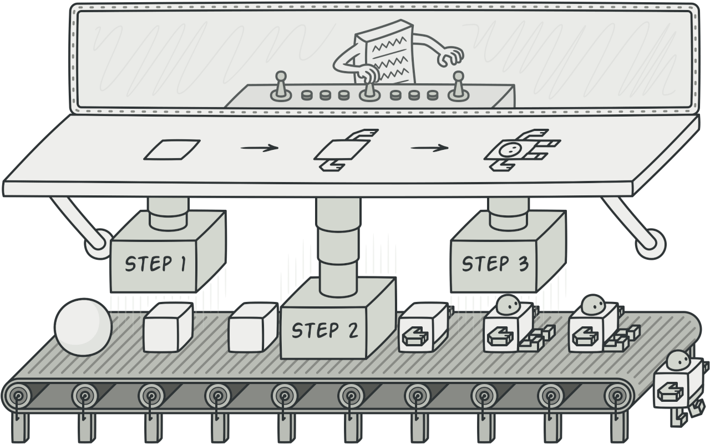
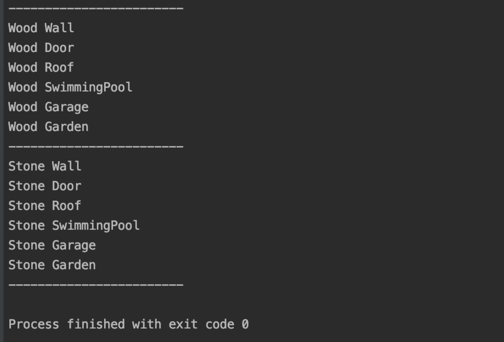

# 1 生成器模式（Builder pattern）
**生成器模式定义**：将一个复杂对象的构建和它的表示进行分离，让你可以一步步的创建对象。并且可以用相同的构建过程来创建不同的表示  
# 2 目标问题

&emsp;&emsp;当你要创建一个复杂对象，有多个小部分祖成。例如房子=四面墙+门+窗子+房顶。一个房子也可以包含一些额外的部件，例如：车库，游泳池，花园等等。如果我们需要创建一个房子，代码的初始化部分会变得过于臃肿，需要多所有额外部件进行设置。可能需要游泳池不需要花园，也可能需要车库不需要泳池，也可能全部都需要。虽然大多数情况泳池，花园都是不必要的。  
&emsp;&emsp;虽然一个巨大的构造函数消除了对子类的需求，但是它实在是太过于不方便，所以可以使用 Builder pattern 解决这个问题。

# 3 解决方法
&emsp;&emsp;新建一个类用来建造房子，即类似于施工队（GoF：ConcreteBuilder）的作用，将原来对象中用来构建的代码移动到该对象中进行管理。如果要创建对象的某一部分，直接在该管理对象中进行调用即可。这样做也可以让你构建不同表示的对象（eg：石头房子或是木头房子），石头房子用石头施工队，木头房子用木头施工队即可。虽然他们建造的对象相同，但是表示方式完全不同，即虽然都是房子，但是确实不同材质的房子。  
&emsp;&emsp;为了实现一条流水线的操作，你还可以创建一个监督者（GoF：Director）用来使用 ConcreteBuilder 完成一系列操作，并将结果返回给你。虽然没有监督者客户也可以自己进行监督，即执行一些列的 build_XXX_Part 函数，但是创建一个监督者可以供代码复用，并将客户和 builder 分离开来。也是个不错的方式  

# 4 所有类之间的关系

- Builder 接口
  - 为创造一个对象（Product）而设计的一系列方法的接口
- ConcreteBuilder 类：
  - 实现 Builder 的接口来构造 Product 的各个部分
  - 定义并跟踪它所长创建的表示
  - 提供一个检索产品的接口（GetProduct）
- Director 类：
  - 构造一个使用 builder 接口的对象
- Product 类：
  - 表示被构造的复杂对象。ConcreteBuilder 创建该 Product 的内部表示并定义其 builde 过程

# 5 代码实现
&emsp;&emsp;接下来使用 GO 代码来进行 Builder pattern 的实现
```go
type HouseBuilder interface {
	buildHouse()
	buildSwimmingPool()
	buildGarden()
	buildGarage()
}
// 木头房施工队
type WoodHouseBuilder struct{
	House
}
// 木头房子施工流程
func (wb *WoodHouseBuilder)buildHouse(){
	wb.Wall = "Wood Wall"
	wb.Door = "Wood Door"
	wb.Roof = "Wood Roof"
}
func (wb *WoodHouseBuilder) buildSwimmingPool(){
	wb.SwimmingPool = "Wood SwimmingPool"
}
func (wb *WoodHouseBuilder) buildGarden(){
	wb.Garden = "Wood Garden"
}
func (wb *WoodHouseBuilder) buildGarage(){
	wb.Garage = "Wood Garage"
}
// 石头房施工队
type StoneHouseBuilder struct{
	House
}
// 石头房子的施工流程
func (sb *StoneHouseBuilder)buildHouse(){
	sb.Wall = "Stone Wall"
	sb.Door = "Stone Door"
	sb.Roof = "Stone Roof"
}
func (sb *StoneHouseBuilder) buildSwimmingPool(){
	sb.SwimmingPool = "Stone SwimmingPool"
}
func (sb *StoneHouseBuilder) buildGarden(){
	sb.Garden = "Stone Garden"
}
func (sb *StoneHouseBuilder) buildGarage(){
	sb.Garage = "Stone Garage"
}
```
&emsp;&emsp;实际的 Builder,通过不同的 Builder 可以获取相同对象的不同表示(eg:木头房子和石头房子)
```go
type House struct {
	Wall string
	Door string
	Roof string
	SwimmingPool string
	Garden string
	Garage string
}
```
&emsp;&emsp;用户最后获得的 House 对象
```go
// 监督者类
type Director struct {
	houseBuilder HouseBuilder  // 真正的 Builder
	class string
}
// 构建 House 的基本部分
func (d *Director) makeHouse(){
	d.houseBuilder.buildSwimmingPool()
	d.houseBuilder.buildGarage()
	d.houseBuilder.buildGarden()
}
// 设置需要的类型
func (d *Director) SetHouseBuilder(t string){
	switch t{
	case "Wood":
		d.houseBuilder = &WoodHouseBuilder{}
	case "Stone":
		d.houseBuilder = &StoneHouseBuilder{}
	}
	d.houseBuilder.buildHouse()
	d.class = t
}
// 获取建好的房子
func (d *Director) GetHouse() *House{
	switch d.class{
	case "Wood":
		return &d.houseBuilder.(*WoodHouseBuilder).House
	case "Stone":
		return &d.houseBuilder.(*StoneHouseBuilder).House
	}
	return nil
}
```
&emsp;&emsp;上面展示了通过 Director 来控制对象的构建流程,可以将一系列的构建操作封装复用.
```go
func main() {
	director := Director{}
	director.SetHouseBuilder("Wood")
	director.makeHouse()
	house := director.GetHouse()
	fmt.Println("------------------------")
	fmt.Println(house.Wall)
	fmt.Println(house.Door)
	fmt.Println(house.Roof)
	fmt.Println(house.SwimmingPool)
	fmt.Println(house.Garage)
	fmt.Println(house.Garden)
	fmt.Println("------------------------")
	director.SetHouseBuilder("Stone")
	director.makeHouse()
	house = director.GetHouse()
	fmt.Println(house.Wall)
	fmt.Println(house.Door)
	fmt.Println(house.Roof)
	fmt.Println(house.SwimmingPool)
	fmt.Println(house.Garage)
	fmt.Println(house.Garden)
	fmt.Println("------------------------")
}
```
&emsp;&emsp;客户执行逻辑如上,新建一个 Director 再通知它你需要什么样的房子,之后交给它进行构建,最后直接获取即可.运行结果如下:


# 6 应用场景
以下情况可以使用**生成器模式**：
- 当创建复杂对象的算法应该独立于该对象的组成部分以及它们的装配方式时。
- 当构造过程必须允许被构造的对象有不同而表示时。
- 使用 Builder 来构造复合对象或其他的复杂对象时。

# 7 优缺点

## 7.1 优点
- 可以逐步构造对象，推迟构造过程或递归运行构造过程。即对构造过程提供更加精确的控制
- 可以改变一个 Product 的内部表示，即使用相同的构造代码获取不同表示的 Product
- 将构造代码和 Product 的业务逻辑代码进行隔离

## 7.2 缺点
- 会让代码变得复杂：因为增加了许多接口以及新的类（貌似大多数模式都有这个😓。。。）

# 8 相关模式

- 很明显可以看出和 Factory 系列的模式类似，区别仅仅是，Builder 注重构造单个对象的过程，而 Factory 注重构造不同系列的对象。
- Builder 也可以实现为单例模式。
- 创建复杂的 Composite 通常使用 Builder 进行递归创建。

# 9 reference

1. 《设计模式》-生成器模式  
2. [design-patterns:Builder](https://refactoring.guru/design-patterns/builder)  
3. [中文维基：生成器模式](https://zh.wikipedia.org/wiki/%E7%94%9F%E6%88%90%E5%99%A8%E6%A8%A1%E5%BC%8F)  