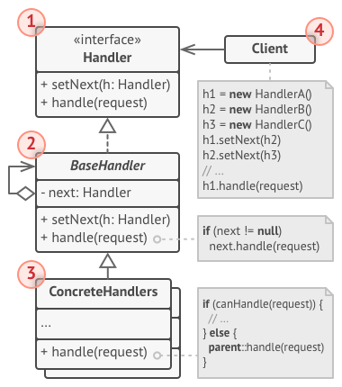
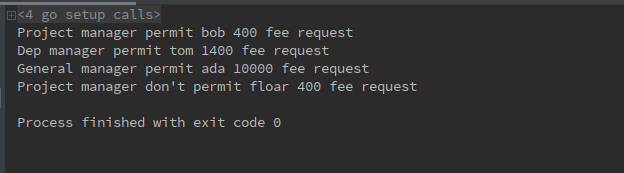

# 1 职责链模式（Chain of Responsibility pattern）
**职责链模式定义**：（对象行为型模式）使多个对象都有机会处理请求，从而避免请求的发送者和接收者之间的耦合关系。将这些对象连成一条链，并沿着这条链传递该请求，直到有一个对象处理它为止.

职责链要点如下：
- 有多个对象共同对一个任务进行处理
- 所有对象呈现链状进行连接起来
- 一个对象处理一个任务的一部分，或者全部执行完
- 客户端负责这个链状结构的构建，但是客户端并不关心任务的交给那个服务端进行处理


# 2 目标问题
&emsp;&emsp;当一个工程中处理一项任务的流程过于繁琐，随着功能的堆砌产生了大量复杂混乱的逻辑，这个时候需要通过一种结构来梳理整个任务的处理流程。

# 3 解决方法
&emsp;&emsp;使用职责链模式创建一系列处理任务的节点。可以类似于流水线的操作，也可以类似于多个 if else 串联起来的操作均可，可以很好的将整个任务分类细化并进行处理。

# 4 所有类之间的关系

1. Handler 接口：
   - 所有处理任务节点遵循的接口
   - 通常包含当前节点处理任务的方法，可能还存在一个方法用来设置下一个处理程序
2. BaseHandle 类：
   - 可选的通用处理节点类
3. ConcreteHandlers 类：
   - 包含用来处理任务的实际代码。收到请求之后，每个处理程序都必须决定是否对其进行处理，并且判断是沿着链进行传递
4. Client：用户逻辑
   - 由用户进行任务处理链表的组装

# 5 代码实现
&emsp;&emsp;下面这个例子构建了三个执行节点，分别是 ProjectManager，DepManager，GeneralManager。通过链表串联起来，接下来层层执行，再根据对应的判断标准，给出答复。
```go
// 所以节点遵循的接口
type Manager interface {
	HaveRight(money int) bool
	HandleFeeRequest(name string, money int) bool
}
// 链表节点类
type RequestChain struct {
	Manager
	successor *RequestChain
}
// 设置下一节点
func (r *RequestChain) SetSuccessor(m *RequestChain) {
	r.successor = m
}
// 处理当前节点判断逻辑
func (r *RequestChain) HandleFeeRequest(name string, money int) bool {
	if r.Manager.HaveRight(money) {
		return r.Manager.HandleFeeRequest(name, money)
	}
	if r.successor != nil {
		return r.successor.HandleFeeRequest(name, money)
	}
	return false
}
// 默认是否可以进入下一节点
func (r *RequestChain) HaveRight(money int) bool {
	return true
}
// 第一种节点
type ProjectManager struct{}
// 创建第一种节点的工厂函数
func NewProjectManagerChain() *RequestChain {
	return &RequestChain{
		Manager: &ProjectManager{},
	}
}
// 通过条件
func (*ProjectManager) HaveRight(money int) bool {
	return money < 500
}
// 在该节点进行处理
func (*ProjectManager) HandleFeeRequest(name string, money int) bool {
	if name == "bob" {
		fmt.Printf("Project manager permit %s %d fee request\n", name, money)
		return true
	}
	fmt.Printf("Project manager don't permit %s %d fee request\n", name, money)
	return false
}
// 第二种节点
type DepManager struct{}
// 创建第二种节点的工厂函数
func NewDepManagerChain() *RequestChain {
	return &RequestChain{
		Manager: &DepManager{},
	}
}
// 通过条件
func (*DepManager) HaveRight(money int) bool {
	return money < 5000
}
// 在该节点进行处理
func (*DepManager) HandleFeeRequest(name string, money int) bool {
	if name == "tom" {
		fmt.Printf("Dep manager permit %s %d fee request\n", name, money)
		return true
	}
	fmt.Printf("Dep manager don't permit %s %d fee request\n", name, money)
	return false
}
// 第三种节点
type GeneralManager struct{}
// 创建第三种节点的工厂函数
func NewGeneralManagerChain() *RequestChain {
	return &RequestChain{
		Manager: &GeneralManager{},
	}
}
// 通过条件
func (*GeneralManager) HaveRight(money int) bool {
	return true
}
// 在该节点进行处理
func (*GeneralManager) HandleFeeRequest(name string, money int) bool {
	if name == "ada" {
		fmt.Printf("General manager permit %s %d fee request\n", name, money)
		return true
	}
	fmt.Printf("General manager don't permit %s %d fee request\n", name, money)
	return false
}
// 用户进行链表的创建，但是并不关系在链表中的执行流程，仅仅获取执行的结果即可
// 这里构建了 ProjectManager -> DepManager -> GeneralManager 的执行链表
func main() {
    // 创建职责链的各个节点
	c1 := NewProjectManagerChain()
	c2 := NewDepManagerChain()
	c3 := NewGeneralManagerChain()
    // 将整个链表连接起来
	c1.SetSuccessor(c2)
	c2.SetSuccessor(c3)

	var c Manager = c1
    // 从链表开始进行任务的处理
	c.HandleFeeRequest("bob", 400)
	c.HandleFeeRequest("tom", 1400)
	c.HandleFeeRequest("ada", 10000)
	c.HandleFeeRequest("floar", 400)
}
```
运行结果如下：


# 6 应用场景
- 当期望程序以各种方式处理不同类型的请求时，请使用职责链模式，但是确切的请求类型及其顺序事先未知
- 当必须按特定顺序执行多个处理程序时，使用职责链模式
- 当用户想在运行时更改一组处理程序及其顺序时，使用职责链模式

# 7 优缺点

## 7.1 优点
- 用户可以自行控制请求处理的顺序
- 单一责任原则。用户可以将调用操作的类与执行操作的类分离
- 开放/封闭原则。用户可以在不破坏现有客户端代码的情况下向应用程序引入新的处理程序（链表节点）

## 7.2 缺点
- 会产生很多细粒度的对象，因为将一个任务的处理步骤进行了细化，各个对象功能较为单一
- 某些请求可能最终无法处理。即可能整个链表不存在处理某一任务的情况。这需要注意提供 default 处理

# 8 相关模式
- 责任链通常与组合模式结合使用。这种情况下，当叶组件获得请求时，它可以将其通过所有父组件链向下一直传递到对象树的根进行处理
- 责任链中的处理程序可以实现为命令。这种情况下，可以在由请求表示的同一上下文对象上执行许多不同的操作

# 9 reference
1. 《设计模式》-职责链模
2. [design-patterns:chain-of-responsibility pattern](https://refactoring.guru/design-patterns/chain-of-responsibility)
3. [本节例子来源](https://github.com/senghoo/golang-design-pattern/tree/master/21_chain_of_responsibility)