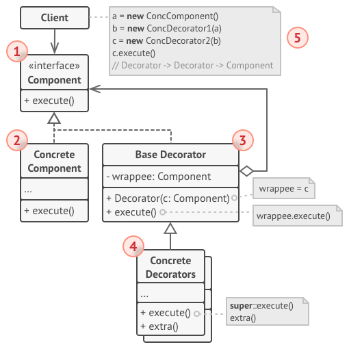
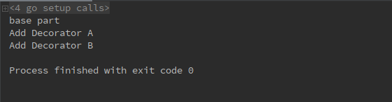

# 1 装饰模式（Decorator pattern）
**装饰模式定义**：（结构型模式）动态的给一个对象添加一些额外的职责。虽然和使用子类来增加功能类似，但是使用装饰模式更加的灵活。

# 2 目标问题
&emsp;&emsp;有时我们希望给某一个对象添加一些功能。例如，一个用户图形界面工具箱可以让你对任意用户界面组件添加一些特性（例如目录，滑动条等），或是一些行为（窗口滑动等）。
&emsp;&emsp;使用继承是添加功能的一种方式，但这种方法并不够灵活，因为附加组件是静态的并不是由用户控制的，我们希望用户可以自由选择添加特性或行为的时机和方式。

# 3 解决方法
&emsp;&emsp;将组件嵌入到另一个对象之中，有这个对象进行特性和行为的添加控制。这个用来添加的对象就是装饰（Decorator）这个装饰和它所包含的接口一致，因此它对使用该组件的客户来说是透明的。它除了对特性和行为的控制之外，要做的仅仅是把客户的调用传递给这个组件即可。可以了解，因为装饰对用户来说是透明的，所以我们可以添加任意多的装饰。

# 4 所有类之间的关系


1. Component 接口：定义一个对象接口，可以给这些对象动态的添加特性和行为
2. Concrete Component 类：定义一个对象，可以给这个对象添加一些特性和行为
3. Base Decorator：维持一个指向 Component 对象的指针，并定义一个与 Component 接口一致的接口
4. Concrete Decorator：接口的具体实现。可以实现多个，并进行嵌套。用来动态的给对象添加特性和行为

# 5 代码实现
&emsp;&emsp;在 Go 中通过使用非入侵式接口和匿名组合可以很简单的就实现装饰模式，框架如下：
```go
// Component 对象接口定义，装饰层和对象层都需要实现该接口
type Component interface {
	Output() string
}
// 装饰的对象
type ConcreteComponent struct {
	base string
}
// 对象实现 Component 接口
func (c *ConcreteComponent) Output() string {
	return c.base
}
// 装饰层 A
type BaseDecoratorA struct {
	Component
	S string
}
// 运行时用来给对象添加特性和行为
func AddDecoratorA(c Component, s string) Component {
	return &BaseDecoratorA{
		Component: c,
		S:         s,
	}
}
// 装饰层实现对象接口
func (d *BaseDecoratorA) Output() string {
	return d.Component.Output() + "\n" + d.S
}
// 装饰层 B
type BaseDecoratorB struct {
	Component
	S string
}
// 运行时用来给对象添加特性和行为
func AddDecoratorB(c Component, s string) Component {
	return &BaseDecoratorB{
		Component: c,
		S:         s,
	}
}
// 装饰层实现对象接口
func (d *BaseDecoratorB) Output() string {
	return d.Component.Output() + "\n" + d.S
}
// 用户逻辑代码，动态添加两层装饰
func main() {
	var c Component = &ConcreteComponent{
		base: "base part",
	}
	c = AddDecoratorA(c, "Add Decorator A")
	c = AddDecoratorB(c, "Add Decorator B")
	s := c.Output()
	fmt.Println(s)
}
```
运行结果如下：

# 6 应用场景

- 在不影响其他对象的情况下，以动态、透明的方式给单个对象添加特性和行为
- 需要动态地给一个对象增加特性和行为，这些功能也可以动态地被撤销

# 7 优缺点

## 7.1 优点
- 装饰模式与继承关系的目的都是要扩展目标对象的功能，但是装饰模式可以在不创建新的子类的前提下完成，拥有更大的灵活性
- 可以在运行时从对象添加或者删除职责
- 通过使用不同的具体装饰类以及这些装饰类的排列组合，可以创造出很多不同行为的组合。可以使用多个具体装饰类来装饰同一对象，得到功能更为强大的对象
- 具体构件类与具体装饰类可以独立变化，用户可以根据需要增加新的具体构件类和具体装饰类，在使用时再对其进行组合，原有代码无须改变，符合“开放/封闭原则”

## 7.2 缺点
- 使用装饰模式进行系统设计时将产生很多小对象，这些对象的区别在于它们之间相互连接的方式有所不同，而不是它们的类或者属性值有所不同，同时还将产生很多具体装饰类。这些装饰类和小对象的产生将增加系统的复杂度，加大学习与理解的难度
- 这种比继承更加灵活机动的特性，也同时意味着装饰模式比继承更加易于出错，排错也很困难，对于多次装饰的对象，调试时寻找错误可能需要逐级排查，较为烦琐

# 8 相关模式
- 相比于适配器模式：装饰模式提供新的功能，适配器模式则是实现了完全不同的接口
- 可以将装饰模式看作仅有一个组件的组合模式。但是装饰模式和组合模式还是有本质区别的，装饰模式目的是给对象添加特性和方法，而组合模式是为了聚合组件

# 9 reference
1. 《设计模式》-装饰模式
2. [design-patterns:Decorator pattern](https://refactoring.guru/design-patterns/decorator)
3. [关于装饰模式的总结部分很不错](https://design-patterns.readthedocs.io/zh_CN/latest/structural_patterns/decorator.html)