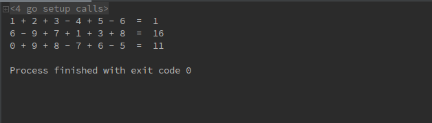

# 1 解释器模式（Interpreter pattern）
**解释器模式定义**：（对象行为型模式）给定一个语言，定义它的文法得一种表示，并定义一个解释器，这个解释器使用该表示来解释语言中的句子。

# 2 目标问题
&emsp;&emsp;在我们很熟悉的程序的编译阶段，使用了解释器，其中包括很多部分：词法分析，语法分析，语义分析。再例如正则表达式。通过提前定义好一个对应的规则，以及如何解释这个正则表达式，来对语句进行匹配。
# 3 所有类之间的关系

1. Abstract Expression：声明一个所有的具体表达式角色都需要实现的抽象接口
   - 这个接口主要是一个interpret()方法，称做解释操作。
2. Terminal Expression：实现了抽象表达式角色所要求的接口，主要是一个 interpret() 方法；文法中的每一个终结符都有一个具体终结表达式与之相对应。
   - 比如有一个简单的公式R=R1+R2，在里面R1和R2就是终结符，对应的解析R1和R2的解释器就是终结符表达式。
3. Compound Expression：文法中的每一条规则都需要一个具体的非终结符表达式，非终结符表达式一般是文法中的运算符或者其他关键字
   - 比如公式 R=R1+R2 中，“+"就是非终结符，解析“+”的解释器就是一个非终结符表达式。
4. Context：用来存储解释器之外的信息
   - 比如 R=R1+R2，我们给 R1 赋值 100，给 R2 赋值 200。这些信息需要存放到环境角色中，很多情况下我们使用Map来充当环境角色就足够了。

# 4 代码实现
```go
// 节点通用接口
type Node interface {
	Interpret() int
}

// 值节点
type ValNode struct {
	val int
}

func (n *ValNode) Interpret() int {
	return n.val
}

// 加号节点
type AddNode struct {
	left, right Node
}

func (n *AddNode) Interpret() int {
	return n.left.Interpret() + n.right.Interpret()
}

// 减号节点
type MinNode struct {
	left, right Node
}

func (n *MinNode) Interpret() int {
	return n.left.Interpret() - n.right.Interpret()
}

// AST
type Parser struct {
	exp   []string
	index int
	prev  Node // AST root 节点
}

// 解析函数
func (p *Parser) Parse(exp string) {
	p.exp = strings.Split(exp, " ")

	for {
		if p.index >= len(p.exp) {
			return
		}
		switch p.exp[p.index] {
		case "+":
			p.prev = p.newAddNode()
		case "-":
			p.prev = p.newMinNode()
		default:
			p.prev = p.newValNode()
		}
	}
}

// 创建新的加号节点
func (p *Parser) newAddNode() Node {
	p.index++
	return &AddNode{
		left:  p.prev,
		right: p.newValNode(),
	}
}

// 创建新的减号节点
func (p *Parser) newMinNode() Node {
	p.index++
	return &MinNode{
		left:  p.prev,
		right: p.newValNode(),
	}
}

// 创建值节点
func (p *Parser) newValNode() Node {
	v, _ := strconv.Atoi(p.exp[p.index])
	p.index++
	return &ValNode{
		val: v,
	}
}

func (p *Parser) Result() Node {
	return p.prev
}

// 用户逻辑
func main() {
    // 三个待解析的语句
	test1 := "1 + 2 + 3 - 4 + 5 - 6"
	test2 := "6 - 9 + 7 + 1 + 3 + 8"
	test3 := "0 + 9 + 8 - 7 + 6 - 5"
    p1 := &Parser{}
    // 进行解析
    p1.Parse(test1)
    // 计算结果
	res1 := p1.Result().Interpret()
	fmt.Println(test1, " = ", res1)
	p2 := &Parser{}
	p2.Parse(test2)
	res2 := p2.Result().Interpret()
	fmt.Println(test2, " = ", res2)
	p3 := &Parser{}
	p3.Parse(test3)
	res3 := p3.Result().Interpret()
	fmt.Println(test3, " = ", res3)
}
```
运行结果如下：


# 5 应用场景
1. 当有一个语言需要解释执行，并且你可将该语言中的句子表示为一个抽象语法树，可以使用解释器模式。而当存在以下情况时该模式效果最好
2. 该文法的类层次结构变得庞大而无法管理。此时语法分析程序生成器这样的工具是最好的选择。他们无需构建抽象语法树即可解释表达式，这样可以节省空间而且还可能节省时间。
3. 效率不是一个关键问题，最高效的解释器通常不是通过直接解释语法分析树实现的，而是首先将他们装换成另一种形式，例如，正则表达式通常被装换成状态机，即使在这种情况下，转换器仍可用解释器模式实现，该模式仍是有用的

# 6 优缺点

## 6.1 优点
1. 可以很容易地改变和扩展方法， 因为该模式使用类来表示方法规则， 你可以使用继承来改变或扩展该方法
2. 也比较容易实现方法， 因为定义抽象语法树总各个节点的类的实现大体类似， 这些类都易于直接编写
3. 解释器模式就是将一句话，转变为实际的命令程序执行而已。 而不用解释器模式本身也可以分析， 但通过继承抽象表达式的方式， 由于依赖转置原则， 使得文法的扩展和维护都带来的方便

## 6.2 缺点
- 解释器模式为方法中的每一条规则至少定义了一个类， 因此包含许多规则的方法可能难以管理和维护。 因此当方法非常复杂时， 使用其他的技术如 语法分析程序 或 编译器生成器来处理
- 解释的时候采用递归调用方法，导致有时候函数的深度会很深，影响效率

# 7 相关模式
- AST 是组合模式的一个实例
- 享元可以在 AST 中共享使用终结符
- 使用迭代器遍历解释器
- 使用访问者模式维护 AST 各个节点的行为

# 8 reference
《设计模式》-解释器模式
[Gang of Four Design Patterns:interpreter-pattern](https://springframework.guru/gang-of-four-design-patterns/interpreter-pattern/)
[Design patterns: Interpreter:讲的很细致](https://medium.com/@sawomirkowalski/design-patterns-interpreter-5b4c0e2b832f)
