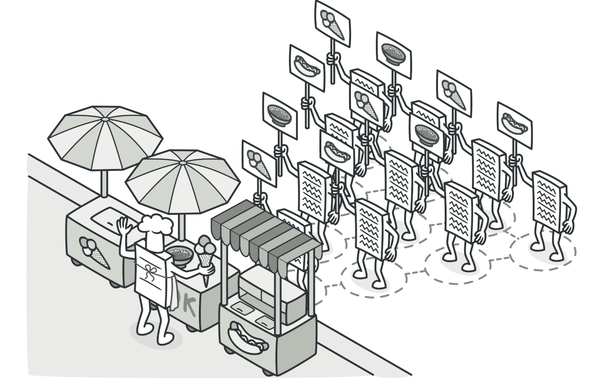
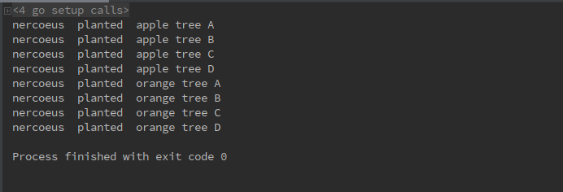

# 1 访问者模式（Visitor pattern）
**访问者模式定义**：（对象行为型模式）表示一个作用域某对象的结构中的各元素的操作。他是你可以在不改变各元素的类的前提下定义作用于这些元素的新操作。

# 2 目标问题
&emsp;&emsp;数据结构中保存着许多元素，对这些元素的处理应该放在什么地方？通常我们最常见的做法就是将这些处理直接放在表示数据结构的类中，当然在很多情况下这算是一种最简单便捷的方式了。但是，当需要经常增加一些处理时，我们就不难发现这种方式存在弊端，即每次增加处理，都需要修改表示数据结构的类，这显然违背了“开闭原则”！

# 3 解决方法
&emsp;&emsp;怎么解决这类问题？将数据结构与处理分开不就好了！表示数据结构的类只需要提供对"访问者"开放的接口(API)，而对元素的处理则由访问者负责，当需要新增一种对元素的处理方式时，只需要编写新的表示访问者的类即可，这样就无需对表示数据结构的类(原有的代码)进行修改，又扩展出了新功能。

# 4 所有类之间的关系

1. Visitor 接口:为该对象结构中 ConcreteElement 的每一个类声明一个 Visit 操作.
2. ConcreteVisitor 具体访问者:
    - 实现每一个由 Visitor 声明的操作.每个操作实现算法的一部分,而该算法片段是对应于结构中对象的类.
    - ConcreteVisitor 为该算法提供上下文并存储他的局部状态.
3. Element 元素接口:
    - 定义一个 Accept 操作,它以一个访问者为参数
4. ConcreteElement 具体元素:
    - 实现 Accept 操作,该操作以一个访问者为参数
5. Client 用户:
    - 代表一个集合或一些其它复杂的元素.通常,用户并不了解具体的元素类,因为它们通过某个抽象接口使用该集合中的对象

# 5 代码实现
使用 GO 实现果园例子，例子来源见本文后面。
```go
// 树坑为目标元素
type Hole interface {
	Accept(Visitor)
}
// 访问者接口，仅提供一个 Visit 接口
type Visitor interface {
	Visit(Hole)
}
// 果园，用来管理所有果树坑
type Orchard struct {
	holes []Hole
}
// 添加一个果树坑
func (o *Orchard) Add(hole Hole) {
	o.holes = append(o.holes, hole)
}
// 实现 Accept 接口，对所有果树坑进行操作
func (o *Orchard) Accept(visitor Visitor) {
	for _, hole := range o.holes {
		hole.Accept(visitor)
	}
}
// 橘子树，一个对象
type OrangeHole struct {
	name string
}
// OrangeHole 的工厂函数
func NewOrangeHole(name string) *OrangeHole {
	return &OrangeHole{
		name: name,
	}
}
// 实现 Accept 操作
func (c *OrangeHole) Accept(visitor Visitor) {
	visitor.Visit(c)
}
// 苹果树，一个对象
type AppleHole struct {
	name string
}
// AppleHole 的工厂函数
func NewAppleHole(name string) *AppleHole {
	return &AppleHole{
		name: name,
	}
}
// 实现 Accept 操作
func (c *AppleHole) Accept(visitor Visitor) {
	visitor.Visit(c)
}
// 果农
type Farmer struct {
	name string
}
// 果农真正的种树操作
func (f *Farmer) Visit(hole Hole) {
	switch c := hole.(type) {
	case *AppleHole:
		fmt.Println(f.name, " planted ", c.name)
	case *OrangeHole:
		fmt.Println(f.name, " planted ", c.name)
	}
}
// 用户操作逻辑
func main() {
	c := &Orchard{}
	c.Add(NewAppleHole("apple tree A"))
	c.Add(NewAppleHole("apple tree B"))
	c.Add(NewAppleHole("apple tree C"))
	c.Add(NewAppleHole("apple tree D"))
	c.Add(NewOrangeHole("orange tree A"))
	c.Add(NewOrangeHole("orange tree B"))
	c.Add(NewOrangeHole("orange tree C"))
	c.Add(NewOrangeHole("orange tree D"))
	c.Accept(&Farmer{name: "nercoeus"})
}
```
运行结果如下：


# 6 应用场景
- 一个对象结构包含很多类对象，它们有不同的接口，而你相对这些对象实施一些依赖于其具体类的操作
- 需要对一个对象结构中的对象进行很多不同并且不相关的操作，而你想避免让这些操作“污染”这些对象的类。访问者模式可以让你将相关操作集中起来定义在一个类中
- 定义对象结构的类很少改变，但经常需要在此结构上定义新的操作。改变对象结构类需要重新定义对所有访问者的接口，这可能需要很大的代价。如果对象结构类经常改变，那么可能还是在这些类中定义这些操作比较好

# 7 优缺点
## 7.1 优点
- 通过访问者模式可以很容易的增加新的操作:仅需增加一个新的访问者即可在一个对象结构上定义一个新的操作.如果功能分散在多个类上的话,定义新操作就需要修改每一个类
- 访问者集中相关操作而分离无关的操作:相关的行为不是分不在定义在该对象结构的每个类上,而是集中在一个访问者上.无关行为被分别放在各自的访问者子类中

## 7.2 缺点
- 每次将类添加到元素层次结构或从元素层次结构中删除时,都需要更新所有访问者
- 访问者可能无法访问他们应该使用的元素的私有字段和方法

# 8 相关模式
- 访问者可以用于一个由组合模式定义的对象结构进行操作
- 访问者可以和解释器模型一起使用

# 9 reference
《设计模式》-访问者模式
[design-patterns:visitor pattern](https://refactoring.guru/design-patterns/visitor)
[访问者模式的果园例子](https://blog.csdn.net/SomeoneMH/article/details/80591429)