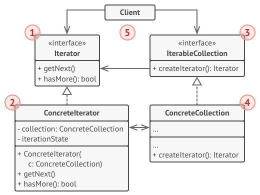
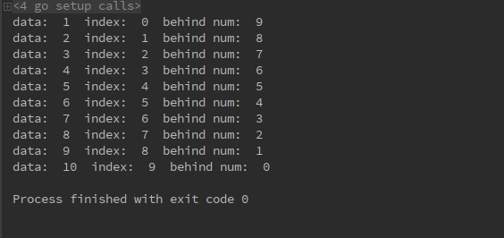

# 1 迭代器模式（Iterator pattern）
&emsp;&emsp;迭代器大家应该十分熟悉，和容器一起使用，用来遍历整个容器，用户通过使用迭代器并不需要关心具体的遍历规则等等。
**迭代器模式定义**：（对象行为型模式）提供一种方法顺序访问一个聚合对象中的各个元素，而又不需要暴露该对象的内部表示。

# 2 目标问题
&emsp;&emsp;一个项目中需要用到许多各种各样的容器，比如栈，队列，链表，二叉树等等。但是如果仅仅定义容器的结构，用户想要遍历容器时就必须使用框架层中容器的代码，这是不好的。所以容器应该自己提供遍历的方式，可以遍历容器中所有的元素，而不是一遍又一遍的访问相同的元素。
&emsp;&emsp;同样的，对于一个复杂的结构，你可能想要多种不同的遍历方式。这样你可以定义多个遍历方式，并将它们耦合到容器代码中。因为客户端不会想要自己去实现复杂结构的多种遍历方式的。
# 3 解决方法
&emsp;&emsp;将对容器的遍历行为整合到一个迭代器对象中。在遍历的同时，迭代器还可以实现其余的附加操作，例如当前是第几个元素等等。
&emsp;&emsp;迭代器可以一直前进，知道没有元素可以遍历为为止。所有的迭代器应该使用相同的接口，只要实现了相同接口的迭代器，就可以在支持这种迭代器的算法中进行使用，而不需要修改客户端的代码。
⭐STL 中实现了十分完善的一套迭代器，包含了所有常用的容器，可以很好的配合一般算法进行使用

# 4 所有类之间的关系

1. Iterator 接口：迭代器定义访问和遍历元素的接口
   - C++ 中一般是 解引用 和 ++ 操作
2. ConcreteIterator 类：
   - 实现了迭代器相对于特定容器的接口
   - 用于具体容器遍历和操作的迭代器
3. IteratorCollection 接口：用来创建相应迭代器对象的接口
4. ConcreteCollection 类：具体聚合实现创建相应迭代器的接口
   - 返回 ConcreteIterator 的一个具体实现
5. Client 用户：用户使用 Iterator 进行容器的遍历访问，就不需要和容器代码进行耦合

# 5 代码实现
```go
// 容器为切片类型
type Ints []int
// 迭代器通用接口
type interator interface {
	HasNext() bool
	Next() int
	Index() int
	BehindNum() int
}
// 返回切片的迭代器
func (i Ints) Iterator() *Iterator {
	return &Iterator{
		data:  &i,
		index: 0,
	}
}
// 迭代器类型
type Iterator struct {
	data  *Ints  // 保存目标容器指针
	index int
}
// 迭代器可执行操作
func (i *Iterator) HasNext() bool {
	return i.index < len(*i.data)
}

func (i *Iterator) Next() (v int) {
	v = (*i.data)[i.index]
	i.index++
	return v
}
func (i *Iterator) Index() int {
	return i.index
}

func (i *Iterator) BehindNum() int {
	return len(*i.data) - i.index - 1
}
// 用户对容器的遍历
func main() {
	ints := Ints{1, 2, 3, 4, 5, 6, 7, 8, 9, 10}
	for it := ints.Iterator(); it.HasNext(); it.Next() {
		fmt.Println("data: ", (*it.data)[it.index], " index: ", it.Index(), " behind num: ", it.BehindNum())
	}
}
```
遍历结果如下：


# 6 应用场景
- 当容器的结构较为复杂，想要对用户隐藏相应的结构（出于方便或安全原因），使用 Iterator 模式
- 使用该模式可以减少遍历应用程序中遍历代码的重复
- 当您希望代码能够遍历不同的数据结构或这些结构的类型事先未知时，请使用 Iterator
- 当想要对容器实现相同的算法，可以通过实现了相同接口的 Iterator 的容器进行操作

# 7 优缺点
## 7.1 优点
- 单一责任原则。可以通过将庞大的遍历算法提取到单独的类以供用户使用
- 开放/封闭原则。可以实现新类型的集合和迭代器，并将它们传递到现有代码而不会破坏任何内容，因为均是通过实现了相同接口的迭代器进行操作
- 可以并行地迭代同一集合，因为每个迭代器对象都包含其自己的迭代状态

## 7.2 缺点
- 使用迭代器可能比直接遍历某些专用集合的元素效率低，因为增加了一层逻辑，而不是直接操作。一般来说这不是阻碍
- 如果您的应用仅适用于简单集合，则应用模式可能会过大。对 stack queue 这种简单的容器可能没有必要使用设计模式

# 8 相关模式
- 迭代器可以用来遍历组合模式的树状结构
- 多态迭代器可以使用工厂模式创建对应的迭代器对象
- 可以将备忘录模式与迭代器模式一起使用以捕获当前迭代状态，并在必要时将其回滚

# 9 reference
《设计模式》-迭代器模式
《STL源码剖析》-迭代器
[design-patterns:Iterator pattern](https://refactoring.guru/design-patterns/iterator)