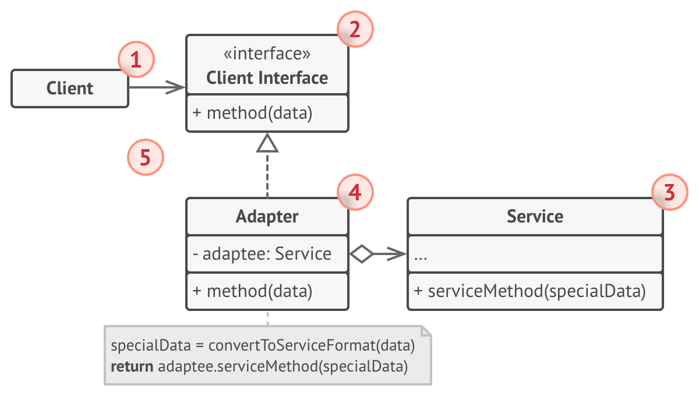
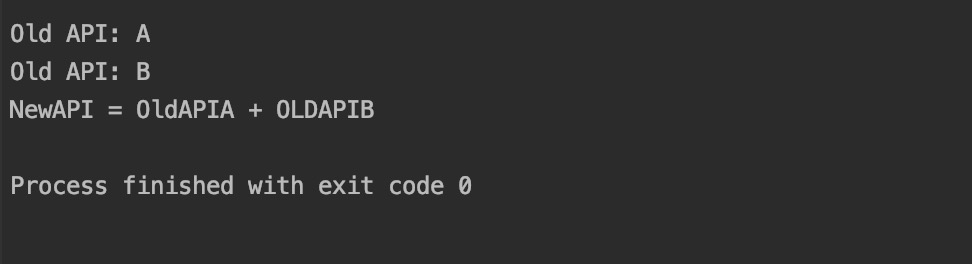

# 1 适配器模式（Adapter pattern）
&emsp;&emsp;早在学习 C++ 的 SGI-STL 时就对适配器模式有过了解,在 STL 中主要分为:容器适配器、迭代器适配器和仿函数适配器.后面再进行简略介绍
**适配器模式定义**:将一个类的接口转换成客户希望的另一个接口.Adapter 模式使得原本由于接口不兼容而不能一起工作的那些类可以一起工作.

# 2 目标问题
&emsp;&emsp;假设我们有一个手机充电器的插头在国内可以很好的工作,因为国内的插头和插座可以很好的匹配,但是一但需要出国出差或者旅游的话,可能就太适用了.各国对插头的标准不一样,这样的话这个插头就不能使用了,虽然插头的功能都是一样的,但是插口不同.如果想要在国外充电的话,还需要再买一个,这无疑是不可以接受的.就像在项目中你不会想再将重复的代码 copy 一遍.
# 3 解决方法
&emsp;&emsp;因为手机插头的功能是不会改变的,所以一般我们仅仅需要购买一个转换器,将国内的插头接口转换为国外的标准即可.这个借口就是适配器,显然,仅仅购买一个插口转接器要比重新购买一个插头要划算的多.
# 4 所有类之间的关系

1. Client 类:其中包含工程中的业务逻辑
2. Client 接口:描述了其他类必须遵循的协议才能与客户端代码进行协作
3. Service 类:一般是 Client 不能直接使用的类,因为它不具备兼容的接口
    1. eg:现有插头
4. Adapter 类:可以同时和客户端与服务器一同进行使用,对 Service 进行包装,实现了 Clinet interface.通过接口获取来自客户端的调用,并用 Service 的方法进行处理.

⭐这样的话,我们就可以在不改变 Client 接口的方式对 Service 进行更换.Service:你随意操作,我自己改变.
⭐当你想要修改 Service 的接口时,仅仅创建一个新的适配器即可

# 5 代码实现
用 Go 实现了适配器模式的大致框架如下:
```go
// 定义一个新的接口
type Target interface {
	NewAPI()
}

// 定义一个老的接口
type Adaptee interface {
	OldAPIA()
	OldAPIB()
}

// 定一个Adapter接口
type Adapter struct {
	adaptee Adaptee
}
// 新的接口由旧的接口实现
func (a *Adapter) NewAPI(){
	a.adaptee.OldAPIA()
	a.adaptee.OldAPIB()
	fmt.Println("NewAPI = OldAPIA + OLDAPIB")
}

// 实现旧接口struct
type oldAdaptee struct {
}
// 原有的接口
func (o *oldAdaptee) OldAPIA(){
	fmt.Println("Old API: A")
}
func (o *oldAdaptee) OldAPIB(){
	fmt.Println("Old API: B")
}
// 用户逻辑
func main(){
	oa := &oldAdaptee{}
	// 定一个适配器对象
	adapter := Adapter{
		adaptee:oa,
	}
	adapter.NewAPI()
}
```
执行结果如下:


# 6 SGI-STL 中的适配器模式
STL 定义了三种适配器用来复用代码,下面开始介绍:
⭐具体的操作和实现请参考《STL源码剖析-第八章》
## 6.1 容器适配器
&emsp;&emsp;容器适配器是这三种适配器中较简单的一种,STL 中的 stack 和 queue 均是通过对 deque 构造适配器实现的.通过在对应的容器适配器中包含 deque 结构,然后通过 deque 的操作,分别实现 stack 和 queue 的接口(其实是 deque 接口的子集).其中 stack 遵循 FILO 原则,queue 遵循 FIFO 原则.

## 6.2 迭代器适配器
迭代适配器主要分为三种,均是对迭代器的适配,分别对应不同的操作
### 6.2.1 Insert iterator
&emsp;&emsp;将一般迭代器的赋值操作变为插入操作,这样迭代器包括:back_insert_iterator 尾端插入,front_insert_iterator 头端插入,insert_iterator 任意位置插入.
### 6.2.2 Reverse iterator
&emsp;&emsp;反方向遍历的迭代器,++ 变为了后退操作,-- 变为了前进操作,主要是为了方便一些反序操作算法.
### 6.2.3 IOStream iterator
&emsp;&emsp;可以将迭代器绑定到某个 iostream 对象上,绑定到 istream 对象身上的称为 istream_iterator,拥有输入功能.绑定到 ostream 对象身上的称为 ostream_iterator,拥有输出功能.这种迭代器主要用于屏幕输出.

## 6.3 仿函数适配器
&emsp;&emsp;functor adapters 是所有配接器中最为庞大的一个族群,且灵活度极高.可以进行配接.这些配接包括:bind,negate(否定),compose(组合),以及对一般函数或成员函数的修饰(使其成为一个仿函数)

# 7 应用场景
- 当你想使用某些以有的类,但其接口与执行逻辑不兼容时,使用 Adapter 进行转换.
- 当你要重用几个缺少某些无法添加到超类的通用功能的现有子类时,请使用该模式,你可以对子类进行扩展,并将缺少的功能添加到 Adapter 中

# 8 优缺点

## 8.1 优点
- 单一责任原则.将用户逻辑代码和转换代码进行分隔.
- 开放/封闭原则.可以很容易的替换新的适配器,也可以在不修改原有代码的情况下增加新的适配器类

## 8.2 缺点
- 类适配器模式的缺点如下:
    - 对于Java、C#等不支持多重继承的语言,一次最多只能适配一个适配者类,而且目标抽象类只能为抽象类,不能为具体类,其使用有一定的局限性,不能将一个适配者类和它的子类都适配到目标接口.
- 对象适配器模式的缺点如下:
    - 与类适配器模式相比,要想置换适配者类的方法就不容易.如果一定要置换掉适配者类的一个或多个方法,就只好先做一个适配者类的子类,将适配者类的方法置换掉,然后再把适配者类的子类当做真正的适配者进行适配,实现过程较为复杂.

# 9 相关模式
- Facade 为现有对象定义了一个新接口,而 Adapter 尝试使现有接口可用.适配器通常只包装一个对象,而 Facade 可以处理整个对象子系统
- Adapter 为包装的对象提供了不同的接口,Proxy 为它提供了相同的接口,Decorator 为它提供了增强的接口
- Adapter 更改现有对象的接口,而 Decorator 在不更改其接口的情况下增强对象.此外,Decorator 支持递归组合,这在使用 Adapter 时是不可能的

# 10 reference
1. 《设计模式》-适配器模式
2. 《STL源码剖析》-第八章:配接器(adapters)
3. [design-patterns:Adapter pattern](https://refactoring.guru/design-patterns/adapter)
4. [图说设计模式-适配器模式](https://design-patterns.readthedocs.io/zh_CN/latest/structural_patterns/adapter.html)
